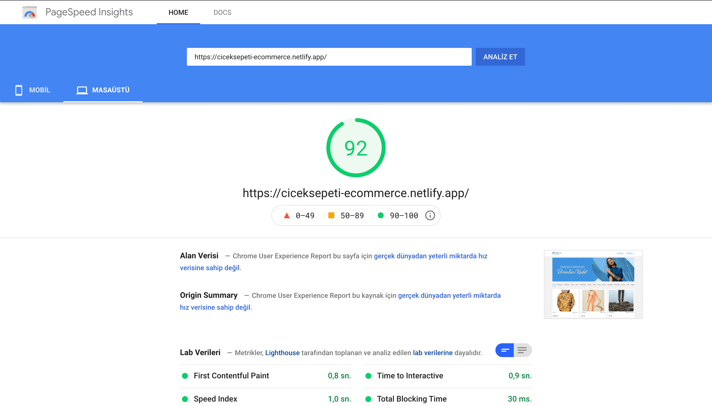
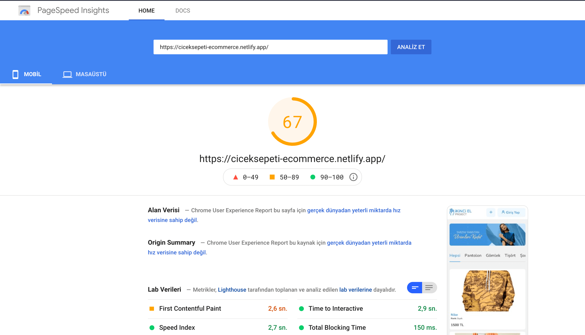

## Available Scripts

For downloading necessary packages, you can run:

`yarn install` or `npm install`

For starting localhost, you can run:

`yarn start` or `npm start`

Runs the app in the development mode.\
Open [http://localhost:3000](http://localhost:3000) to view it in the browser.

The page will reload if you make edits.\
You will also see any lint errors in the console.

## Performance Images

### In Google Page Speed Insights
Below images taken after publishing the website.\
\
<b>For Desktop:</b>\
92 is my top point, most of the time I got between 85-92 points.\
\
\
\
<b>For Mobile:</b>\
67 is my top point, most of the time I got between 60-67 points.\
\

### In Production Mode
Below images taken after building the file (in localhost).\
\
<b>For Desktop:</b>\
83 is my top point, most of the time I got between 80-83 points.\
\
\
\
<b>For Mobile:</b>\
65 is my top point, most of the time I got between 63-65 points.\
\

### In Development Mode
If you are interesting with the development mode performance scores you can find them in performance-images folder.

